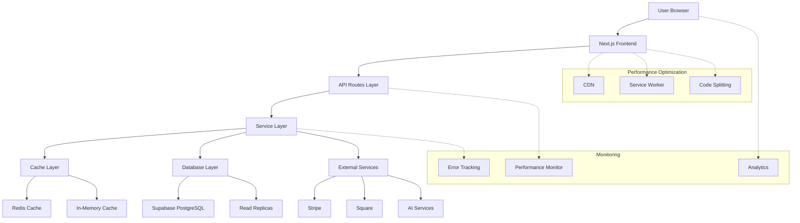
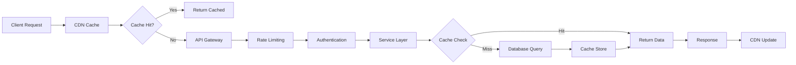

# Technical Architecture: Feature Enhancement Implementation

## 1. Architecture Overview

### 1.1 Enhanced System Architecture



### 1.2 Performance Optimization Layer



## 2. Technology Stack Enhancements

### 2.1 Frontend Optimizations

#### Bundle Optimization Configuration
```typescript
// next.config.js optimizations
const nextConfig = {
  // Code splitting optimization
  experimental: {
    optimizeCss: true,
    scrollRestoration: true,
  },
  
  // Webpack optimizations
  webpack: (config, { isServer }) => {
    if (!isServer) {
      config.optimization.splitChunks = {
        chunks: 'all',
        cacheGroups: {
          vendor: {
            test: /[\\/]node_modules[\\/]/,
            name: 'vendors',
            priority: 10,
            enforce: true,
          },
          common: {
            minChunks: 2,
            priority: 5,
            reuseExistingChunk: true,
          },
        },
      };
    }
    return config;
  },
  
  // Image optimization
  images: {
    domains: ['supabase.co'],
    formats: ['image/avif', 'image/webp'],
  },
  
  // Compression
  compress: true,
  poweredByHeader: false,
};
```

#### Component Optimization Patterns
```typescript
// Optimized component with memoization
import React, { memo, useMemo, useCallback } from 'react';

interface OptimizedComponentProps {
  userId: string;
  data: any[];
  onUpdate: (id: string) => void;
}

export const OptimizedComponent = memo<OptimizedComponentProps>(
  ({ userId, data, onUpdate }) => {
    // Memoize expensive calculations
    const processedData = useMemo(() => {
      return data.reduce((acc, item) => {
        if (item.active && item.value > 0) {
          acc.push({
            ...item,
            computedValue: item.value * 2.5,
            timestamp: new Date().toISOString(),
          });
        }
        return acc;
      }, []);
    }, [data]);
    
    // Memoize callbacks to prevent unnecessary re-renders
    const handleUpdate = useCallback((id: string) => {
      onUpdate(id);
    }, [onUpdate]);
    
    return (
      <div>
        {processedData.map((item) => (
          <div key={item.id} onClick={() => handleUpdate(item.id)}>
            {item.computedValue}
          </div>
        ))}
      </div>
    );
  }
);

// Lazy loading for heavy components
const HeavyComponent = React.lazy(() => 
  import('./HeavyComponent').then(({ HeavyComponent }) => ({
    default: HeavyComponent,
  }))
);
```

### 2.2 Backend Service Enhancements

#### Caching Strategy Implementation
```typescript
// Redis cache service
import Redis from 'ioredis';
import { LRUCache } from 'lru-cache';

export class CacheService {
  private redis: Redis;
  private localCache: LRUCache<string, any>;
  
  constructor() {
    this.redis = new Redis({
      host: process.env.REDIS_HOST,
      port: parseInt(process.env.REDIS_PORT || '6379'),
      password: process.env.REDIS_PASSWORD,
      retryDelayOnFailover: 100,
      maxRetriesPerRequest: 3,
    });
    
    this.localCache = new LRUCache({
      max: 500, // 500 items
      ttl: 1000 * 60 * 5, // 5 minutes
    });
  }
  
  async get<T>(key: string): Promise<T | null> {
    // Check local cache first
    const localValue = this.localCache.get(key);
    if (localValue) return localValue;
    
    // Check Redis cache
    const redisValue = await this.redis.get(key);
    if (redisValue) {
      const parsed = JSON.parse(redisValue);
      this.localCache.set(key, parsed);
      return parsed;
    }
    
    return null;
  }
  
  async set<T>(key: string, value: T, ttlSeconds = 900): Promise<void> {
    const serialized = JSON.stringify(value);
    
    // Set in both caches
    this.localCache.set(key, value);
    await this.redis.setex(key, ttlSeconds, serialized);
  }
  
  async invalidate(pattern: string): Promise<void> {
    const keys = await this.redis.keys(pattern);
    if (keys.length > 0) {
      await this.redis.del(...keys);
    }
  }
}
```

#### AI Service Optimization
```typescript
// Optimized AI personalization service
export class OptimizedAIPersonalizationService {
  private cache: CacheService;
  private readonly CACHE_TTL = 900; // 15 minutes
  
  constructor() {
    this.cache = new CacheService();
  }
  
  async getPersonalizedInsights(userId: string): Promise<AIInsights> {
    const cacheKey = `ai:insights:${userId}`;
    
    // Check cache first
    const cached = await this.cache.get<AIInsights>(cacheKey);
    if (cached) {
      return cached;
    }
    
    // Generate insights if not cached
    const insights = await this.generateInsights(userId);
    
    // Cache the result
    await this.cache.set(cacheKey, insights, this.CACHE_TTL);
    
    return insights;
  }
  
  private async generateInsights(userId: string): Promise<AIInsights> {
    // Single-pass data processing
    const userData = await this.fetchUserData(userId);
    
    // Optimized calculations using single-pass operations
    const insights = this.calculateInsights(userData);
    
    return {
      userId,
      insights,
      generatedAt: new Date().toISOString(),
      confidence: this.calculateConfidence(insights),
    };
  }
  
  private calculateInsights(data: UserData): Insight[] {
    // Single-pass calculation instead of multiple iterations
    return data.entries.reduce((acc, entry) => {
      // Calculate mood trends
      if (entry.mood) {
        acc.moodTrends.push({
          date: entry.date,
          mood: entry.mood,
          trend: this.calculateMoodTrend(entry, data.entries),
        });
      }
      
      // Calculate behavior patterns
      if (entry.behavior) {
        acc.patterns.push({
          type: entry.behavior.type,
          frequency: this.calculateFrequency(entry.behavior, data.entries),
          impact: this.calculateImpact(entry.behavior),
        });
      }
      
      return acc;
    }, { moodTrends: [], patterns: [] });
  }
}
```

#### Database Query Optimization
```typescript
// Optimized data service with batching
export class OptimizedDataService {
  private cache: CacheService;
  
  constructor() {
    this.cache = new CacheService();
  }
  
  async getUserDashboardData(userId: string): Promise<DashboardData> {
    const cacheKey = `dashboard:${userId}`;
    
    // Check cache
    const cached = await this.cache.get<DashboardData>(cacheKey);
    if (cached) return cached;
    
    // Parallel data fetching
    const [
      userProfile,
      recentEntries,
      goals,
      notifications,
      stats,
    ] = await Promise.all([
      this.getUserProfile(userId),
      this.getRecentEntries(userId, 10),
      this.getUserGoals(userId),
      this.getNotifications(userId, 20),
      this.getUserStats(userId),
    ]);
    
    const dashboardData: DashboardData = {
      userProfile,
      recentEntries,
      goals,
      notifications,
      stats,
      generatedAt: new Date().toISOString(),
    };
    
    // Cache for 5 minutes
    await this.cache.set(cacheKey, dashboardData, 300);
    
    return dashboardData;
  }
  
  private async getRecentEntries(userId: string, limit: number): Promise<Entry[]> {
    // Optimized query with proper indexing
    const { data, error } = await supabase
      .from('journal_entries')
      .select(`
        id,
        title,
        content,
        mood,
        created_at,
        updated_at
      `)
      .eq('user_id', userId)
      .order('created_at', { ascending: false })
      .limit(limit);
    
    if (error) throw error;
    return data || [];
  }
  
  // Batch operations for better performance
  async batchUpdateEntries(entries: Entry[]): Promise<void> {
    // Batch update instead of individual updates
    const updates = entries.map(entry => ({
      id: entry.id,
      title: entry.title,
      content: entry.content,
      mood: entry.mood,
      updated_at: new Date().toISOString(),
    }));
    
    const { error } = await supabase
      .from('journal_entries')
      .upsert(updates);
    
    if (error) throw error;
    
    // Invalidate related caches
    const userIds = [...new Set(entries.map(e => e.user_id))];
    await Promise.all(
      userIds.map(userId => 
        this.cache.invalidate(`dashboard:${userId}*`)
      )
    );
  }
}
```

### 2.3 Booking System Optimization

#### Batch Processing Implementation
```typescript
// Optimized booking service
export class OptimizedBookingService {
  private cache: CacheService;
  private readonly BATCH_SIZE = 50;
  
  constructor() {
    this.cache = new CacheService();
  }
  
  async createBatchBookings(bookings: BookingRequest[]): Promise<BookingResult[]> {
    // Validate all bookings first
    const validationResults = await this.validateBatchBookings(bookings);
    const validBookings = validationResults.filter(r => r.isValid);
    
    if (validBookings.length === 0) {
      return validationResults.map(r => ({
        success: false,
        error: r.error,
        bookingId: null,
      }));
    }
    
    // Process in batches
    const results: BookingResult[] = [];
    for (let i = 0; i < validBookings.length; i += this.BATCH_SIZE) {
      const batch = validBookings.slice(i, i + this.BATCH_SIZE);
      const batchResults = await this.processBookingBatch(batch);
      results.push(...batchResults);
    }
    
    // Invalidate availability cache
    await this.invalidateAvailabilityCache(validBookings);
    
    return results;
  }
  
  private async processBookingBatch(batch: ValidatedBooking[]): Promise<BookingResult[]> {
    // Start database transaction
    const client = await supabase.rpc('begin_transaction');
    
    try {
      // Batch insert bookings
      const bookingData = batch.map(booking => ({
        user_id: booking.userId,
        therapist_id: booking.therapistId,
        service_id: booking.serviceId,
        start_time: booking.startTime,
        end_time: booking.endTime,
        status: 'confirmed',
        created_at: new Date().toISOString(),
      }));
      
      const { data: bookings, error: insertError } = await supabase
        .from('bookings')
        .insert(bookingData)
        .select();
      
      if (insertError) throw insertError;
      
      // Batch process payments
      const paymentResults = await this.processBatchPayments(batch, bookings);
      
      // Commit transaction
      await supabase.rpc('commit_transaction');
      
      return bookings.map((booking, index) => ({
        success: true,
        bookingId: booking.id,
        paymentId: paymentResults[index]?.paymentId,
      }));
      
    } catch (error) {
      // Rollback transaction
      await supabase.rpc('rollback_transaction');
      
      // Return error for all bookings in batch
      return batch.map(() => ({
        success: false,
        error: error.message,
        bookingId: null,
      }));
    }
  }
  
  async getAvailability(therapistId: string, date: string): Promise<TimeSlot[]> {
    const cacheKey = `availability:${therapistId}:${date}`;
    
    // Check cache first
    const cached = await this.cache.get<TimeSlot[]>(cacheKey);
    if (cached) return cached;
    
    // Fetch availability data
    const availability = await this.calculateAvailability(therapistId, date);
    
    // Cache for 5 minutes
    await this.cache.set(cacheKey, availability, 300);
    
    return availability;
  }
  
  private async calculateAvailability(therapistId: string, date: string): Promise<TimeSlot[]> {
    // Single query to get all necessary data
    const { data, error } = await supabase
      .rpc('get_therapist_availability', {
        p_therapist_id: therapistId,
        p_date: date,
      });
    
    if (error) throw error;
    
    return data.map(slot => ({
      startTime: slot.start_time,
      endTime: slot.end_time,
      isAvailable: slot.is_available,
      serviceId: slot.service_id,
    }));
  }
}
```

## 3. Database Optimization

### 3.1 Index Strategy

```sql
-- Performance indexes for AI service
CREATE INDEX IF NOT EXISTS idx_ai_interactions_user_timestamp 
ON ai_interactions(user_id, created_at DESC);

CREATE INDEX IF NOT EXISTS idx_ai_user_profiles_user 
ON ai_user_profiles(user_id);

-- Booking system indexes
CREATE INDEX IF NOT EXISTS idx_bookings_user_status 
ON bookings(user_id, status, start_time DESC);

CREATE INDEX IF NOT EXISTS idx_bookings_therapist_date 
ON bookings(therapist_id, start_time, end_time);

CREATE INDEX IF NOT EXISTS idx_availability_slots 
ON availability_slots(therapist_id, date, start_time);

-- Community features indexes
CREATE INDEX IF NOT EXISTS idx_community_posts_status_created 
ON community_posts(status, created_at DESC);

CREATE INDEX IF NOT EXISTS idx_community_posts_user 
ON community_posts(user_id, created_at DESC);

-- Subscription management indexes
CREATE INDEX IF NOT EXISTS idx_user_subscriptions_status 
ON user_subscriptions(user_id, status, created_at DESC);

CREATE INDEX IF NOT EXISTS idx_payments_user_status 
ON payments(user_id, status, created_at DESC);
```

### 3.2 Query Optimization

```sql
-- Optimized availability query
CREATE OR REPLACE FUNCTION get_therapist_availability(
  p_therapist_id UUID,
  p_date DATE
) RETURNS TABLE (
  start_time TIMESTAMP,
  end_time TIMESTAMP,
  is_available BOOLEAN,
  service_id UUID
) AS $$
BEGIN
  RETURN QUERY
  SELECT 
    s.start_time,
    s.end_time,
    CASE 
      WHEN b.id IS NULL THEN true
      ELSE false
    END as is_available,
    s.service_id
  FROM availability_slots s
  LEFT JOIN bookings b ON (
    b.therapist_id = p_therapist_id 
    AND b.start_time < s.end_time 
    AND b.end_time > s.start_time
    AND b.status IN ('confirmed', 'pending')
    AND DATE(b.start_time) = p_date
  )
  WHERE s.therapist_id = p_therapist_id
    AND s.date = p_date
    AND s.is_active = true
  ORDER BY s.start_time;
END;
$$ LANGUAGE plpgsql;

-- Optimized user dashboard query
CREATE OR REPLACE FUNCTION get_user_dashboard_data(
  p_user_id UUID
) RETURNS JSON AS $$
DECLARE
  result JSON;
BEGIN
  SELECT json_build_object(
    'profile', (SELECT row_to_json(u) FROM user_profiles u WHERE u.user_id = p_user_id),
    'recent_entries', (
      SELECT json_agg(row_to_json(e))
      FROM journal_entries e
      WHERE e.user_id = p_user_id
      ORDER BY e.created_at DESC
      LIMIT 10
    ),
    'goals', (
      SELECT json_agg(row_to_json(g))
      FROM goals g
      WHERE g.user_id = p_user_id
      AND g.status = 'active'
    ),
    'notifications', (
      SELECT json_agg(row_to_json(n))
      FROM notifications n
      WHERE n.user_id = p_user_id
      AND n.read = false
      ORDER BY n.created_at DESC
      LIMIT 20
    ),
    'stats', json_build_object(
      'total_entries', (SELECT COUNT(*) FROM journal_entries WHERE user_id = p_user_id),
      'streak_days', calculate_user_streak(p_user_id),
      'last_activity', (SELECT MAX(created_at) FROM journal_entries WHERE user_id = p_user_id)
    )
  ) INTO result;
  
  RETURN result;
END;
$$ LANGUAGE plpgsql;
```

## 4. Monitoring & Analytics

### 4.1 Performance Monitoring

```typescript
// Performance monitoring service
export class PerformanceMonitor {
  private metrics: Map<string, number[]> = new Map();
  private histograms: Map<string, any> = new Map();
  
  trackAPICall(endpoint: string, duration: number, success: boolean) {
    const key = `api_${endpoint}`;
    
    if (!this.metrics.has(key)) {
      this.metrics.set(key, []);
    }
    
    this.metrics.get(key)!.push(duration);
    
    // Track in histogram
    this.trackHistogram('api_duration', duration, {
      endpoint,
      success: success.toString(),
    });
    
    // Alert if performance degrades
    if (duration > 1000) { // 1 second threshold
      this.sendAlert('high_response_time', { endpoint, duration });
    }
  }
  
  trackDatabaseQuery(query: string, duration: number) {
    this.trackHistogram('db_query_duration', duration, {
      query_type: this.getQueryType(query),
    });
    
    if (duration > 500) { // 500ms threshold
      this.logSlowQuery(query, duration);
    }
  }
  
  private trackHistogram(name: string, value: number, labels: Record<string, string>) {
    const key = `${name}_${JSON.stringify(labels)}`;
    
    if (!this.histograms.has(key)) {
      this.histograms.set(key, {
        count: 0,
        sum: 0,
        values: [],
      });
    }
    
    const histogram = this.histograms.get(key)!;
    histogram.count++;
    histogram.sum += value;
    histogram.values.push(value);
    
    // Keep only last 1000 values for percentile calculation
    if (histogram.values.length > 1000) {
      histogram.values = histogram.values.slice(-1000);
    }
  }
  
  getMetrics(): PerformanceMetrics {
    const metrics: PerformanceMetrics = {
      api: {},
      database: {},
      cache: {},
    };
    
    // Calculate API metrics
    for (const [key, values] of this.metrics) {
      if (key.startsWith('api_')) {
        const endpoint = key.replace('api_', '');
        const sorted = values.sort((a, b) => a - b);
        
        metrics.api[endpoint] = {
          avg: values.reduce((a, b) => a + b, 0) / values.length,
          p50: sorted[Math.floor(sorted.length * 0.5)],
          p95: sorted[Math.floor(sorted.length * 0.95)],
          p99: sorted[Math.floor(sorted.length * 0.99)],
          count: values.length,
        };
      }
    }
    
    return metrics;
  }
}
```

### 4.2 Error Tracking

```typescript
// Enhanced error tracking
export class ErrorTracker {
  private errorBuffer: Array<ErrorEvent> = [];
  private readonly BATCH_SIZE = 10;
  private readonly FLUSH_INTERVAL = 5000; // 5 seconds
  
  constructor() {
    // Flush errors every 5 seconds
    setInterval(() => this.flushErrors(), this.FLUSH_INTERVAL);
    
    // Handle uncaught errors
    process.on('uncaughtException', (error) => {
      this.trackError(error, 'uncaught_exception');
    });
    
    process.on('unhandledRejection', (reason, promise) => {
      this.trackError(new Error(`Unhandled rejection: ${reason}`), 'unhandled_rejection');
    });
  }
  
  trackError(error: Error, context: string, metadata?: Record<string, any>) {
    const errorEvent: ErrorEvent = {
      timestamp: new Date().toISOString(),
      message: error.message,
      stack: error.stack,
      context,
      metadata,
      environment: process.env.NODE_ENV,
      service: process.env.SERVICE_NAME,
    };
    
    this.errorBuffer.push(errorEvent);
    
    // Flush immediately if buffer is full
    if (this.errorBuffer.length >= this.BATCH_SIZE) {
      this.flushErrors();
    }
    
    // Log locally for immediate debugging
    console.error(`[${context}] ${error.message}`, metadata);
  }
  
  private async flushErrors() {
    if (this.errorBuffer.length === 0) return;
    
    const errors = [...this.errorBuffer];
    this.errorBuffer = [];
    
    try {
      // Send to error tracking service
      await fetch('https://errors.ekaacc.com/api/errors', {
        method: 'POST',
        headers: {
          'Content-Type': 'application/json',
          'Authorization': `Bearer ${process.env.ERROR_TRACKING_TOKEN}`,
        },
        body: JSON.stringify({ errors }),
      });
    } catch (error) {
      // If sending fails, put errors back in buffer
      this.errorBuffer.unshift(...errors);
      
      // Keep only last 100 errors to prevent memory issues
      if (this.errorBuffer.length > 100) {
        this.errorBuffer = this.errorBuffer.slice(-100);
      }
    }
  }
}
```

## 5. Security Enhancements

### 5.1 Rate Limiting

```typescript
// Advanced rate limiting with Redis
export class RateLimiter {
  private redis: Redis;
  private readonly WINDOW_MS = 60 * 1000; // 1 minute
  private readonly MAX_REQUESTS = 100;
  
  constructor() {
    this.redis = new Redis({
      host: process.env.REDIS_HOST,
      port: parseInt(process.env.REDIS_PORT || '6379'),
    });
  }
  
  async checkLimit(identifier: string): Promise<RateLimitResult> {
    const key = `rate_limit:${identifier}`;
    const now = Date.now();
    const windowStart = now - this.WINDOW_MS;
    
    // Use Redis pipeline for atomic operations
    const pipeline = this.redis.pipeline();
    
    // Remove expired entries
    pipeline.zremrangebyscore(key, 0, windowStart);
    
    // Count current requests
    pipeline.zcard(key);
    
    // Add current request
    pipeline.zadd(key, now, now.toString());
    
    // Set expiration
    pipeline.expire(key, Math.ceil(this.WINDOW_MS / 1000));
    
    const results = await pipeline.exec();
    const requestCount = results[1][1] as number;
    
    const remaining = Math.max(0, this.MAX_REQUESTS - requestCount);
    const resetTime = now + this.WINDOW_MS;
    
    return {
      allowed: requestCount < this.MAX_REQUESTS,
      remaining,
      resetTime,
      retryAfter: requestCount >= this.MAX_REQUESTS ? this.WINDOW_MS / 1000 : null,
    };
  }
}
```

### 5.2 Input Validation

```typescript
// Enhanced input validation with Zod
import { z } from 'zod';

const bookingSchema = z.object({
  userId: z.string().uuid(),
  therapistId: z.string().uuid(),
  serviceId: z.string().uuid(),
  startTime: z.string().datetime(),
  endTime: z.string().datetime(),
  notes: z.string().max(500).optional(),
}).refine((data) => {
  return new Date(data.endTime) > new Date(data.startTime);
}, {
  message: "End time must be after start time",
  path: ["endTime"],
});

const userProfileSchema = z.object({
  name: z.string().min(2).max(100).trim(),
  email: z.string().email().toLowerCase().trim(),
  phone: z.string().regex(/^\+?[1-9]\d{1,14}$/).optional(),
  bio: z.string().max(1000).trim().optional(),
  preferences: z.object({
    notifications: z.object({
      email: z.boolean(),
      sms: z.boolean(),
      push: z.boolean(),
    }),
    privacy: z.object({
      profileVisible: z.boolean(),
      showActivity: z.boolean(),
    }),
  }).optional(),
});

export class ValidationService {
  static validateBooking(data: unknown) {
    try {
      return bookingSchema.parse(data);
    } catch (error) {
      if (error instanceof z.ZodError) {
        throw new ValidationError('Invalid booking data', error.errors);
      }
      throw error;
    }
  }
  
  static validateUserProfile(data: unknown) {
    try {
      return userProfileSchema.parse(data);
    } catch (error) {
      if (error instanceof z.ZodError) {
        throw new ValidationError('Invalid profile data', error.errors);
      }
      throw error;
    }
  }
}
```

## 6. Deployment & Scaling

### 6.1 Container Configuration

```dockerfile
# Optimized Dockerfile for Next.js
FROM node:18-alpine AS base

# Install dependencies only when needed
FROM base AS deps
RUN apk add --no-cache libc6-compat
WORKDIR /app

# Install dependencies based on the preferred package manager
COPY package.json yarn.lock* package-lock.json* pnpm-lock.yaml* ./
RUN \
  if [ -f yarn.lock ]; then yarn --frozen-lockfile; \
  elif [ -f package-lock.json ]; then npm ci; \
  elif [ -f pnpm-lock.yaml ]; then yarn global add pnpm && pnpm i --frozen-lockfile; \
  else echo "Lockfile not found." && exit 1; \
  fi


# Rebuild the source code only when needed
FROM base AS builder
WORKDIR /app
COPY --from=deps /app/node_modules ./node_modules
COPY . .

# Environment variables must be present at build time
ENV NEXT_TELEMETRY_DISABLED 1

RUN npm run build

# Production image, copy all the files and run next
FROM base AS runner
WORKDIR /app

ENV NODE_ENV production
ENV NEXT_TELEMETRY_DISABLED 1

RUN addgroup --system --gid 1001 nodejs
RUN adduser --system --uid 1001 nextjs

COPY --from=builder /app/public ./public

# Set the correct permission for prerender cache
RUN mkdir .next
RUN chown nextjs:nodejs .next

# Automatically leverage output traces to reduce image size
COPY --from=builder --chown=nextjs:nodejs /app/.next/standalone ./
COPY --from=builder --chown=nextjs:nodejs /app/.next/static ./.next/static

USER nextjs

EXPOSE 3000

ENV PORT 3000
ENV HOSTNAME "0.0.0.0"

CMD ["node", "server.js"]
```

### 6.2 Scaling Configuration

```yaml
# Kubernetes deployment configuration
apiVersion: apps/v1
kind: Deployment
metadata:
  name: eka-web
spec:
  replicas: 3
  selector:
    matchLabels:
      app: eka-web
  template:
    metadata:
      labels:
        app: eka-web
    spec:
      containers:
      - name: eka-web
        image: ekaacc/web:latest
        ports:
        - containerPort: 3000
        env:
        - name: NODE_ENV
          value: "production"
        - name: REDIS_URL
          valueFrom:
            secretKeyRef:
              name: eka-secrets
              key: redis-url
        resources:
          requests:
            memory: "256Mi"
            cpu: "250m"
          limits:
            memory: "512Mi"
            cpu: "500m"
        livenessProbe:
          httpGet:
            path: /api/health
            port: 3000
          initialDelaySeconds: 30
          periodSeconds: 10
        readinessProbe:
          httpGet:
            path: /api/ready
            port: 3000
          initialDelaySeconds: 5
          periodSeconds: 5
---
apiVersion: autoscaling/v2
kind: HorizontalPodAutoscaler
metadata:
  name: eka-web-hpa
spec:
  scaleTargetRef:
    apiVersion: apps/v1
    kind: Deployment
    name: eka-web
  minReplicas: 3
  maxReplicas: 10
  metrics:
  - type: Resource
    resource:
      name: cpu
      target:
        type: Utilization
        averageUtilization: 70
  - type: Resource
    resource:
      name: memory
      target:
        type: Utilization
        averageUtilization: 80
```

## 7. Testing Strategy

### 7.1 Performance Testing

```typescript
// Load testing with k6
import http from 'k6/http';
import { check, sleep } from 'k6';
import { Rate } from 'k6/metrics';

const errorRate = new Rate('errors');

export const options = {
  stages: [
    { duration: '5m', target: 100 },   // Ramp up to 100 users
    { duration: '10m', target: 100 }, // Stay at 100 users
    { duration: '5m', target: 200 },   // Ramp up to 200 users
    { duration: '10m', target: 200 }, // Stay at 200 users
    { duration: '5m', target: 0 },    // Ramp down
  ],
  thresholds: {
    http_req_duration: ['p(95)<800'], // 95% of requests under 800ms
    http_req_failed: ['rate<0.005'],   // Error rate under 0.5%
    'errors': ['rate<0.01'],           // Custom error rate under 1%
  },
};

export default function () {
  const userId = `user_${Math.floor(Math.random() * 1000)}`;
  
  // Test AI insights endpoint
  const aiResponse = http.get(`https://api.ekaacc.com/api/ai/insights/${userId}`, {
    headers: {
      'Authorization': `Bearer ${__ENV.API_TOKEN}`,
      'Content-Type': 'application/json',
    },
  });
  
  check(aiResponse, {
    'AI insights status is 200': (r) => r.status === 200,
    'AI insights response time < 800ms': (r) => r.timings.duration < 800,
  });
  
  errorRate.add(aiResponse.status !== 200);
  
  // Test booking availability
  const therapistId = `therapist_${Math.floor(Math.random() * 100)}`;
  const date = new Date().toISOString().split('T')[0];
  
  const bookingResponse = http.get(
    `https://api.ekaacc.com/api/booking/availability/${therapistId}/${date}`,
    {
      headers: {
        'Authorization': `Bearer ${__ENV.API_TOKEN}`,
        'Content-Type': 'application/json',
      },
    }
  );
  
  check(bookingResponse, {
    'Booking availability status is 200': (r) => r.status === 200,
    'Booking availability response time < 500ms': (r) => r.timings.duration < 500,
  });
  
  errorRate.add(bookingResponse.status !== 200);
  
  sleep(1);
}
```