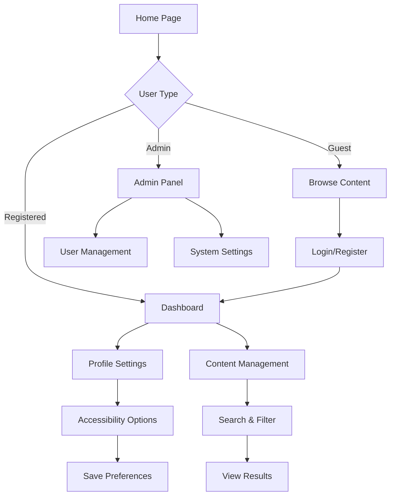

## 1. Product Overview
A modern web application providing seamless user experiences with intuitive navigation, responsive design, accessibility features, and comprehensive error handling. The platform serves diverse user needs through clean interfaces and robust functionality while maintaining high performance and reliability standards.

Target users include general web users requiring accessible, mobile-friendly interfaces with consistent performance across devices and browsers.

## 2. Core Features

### 2.1 User Roles
| Role | Registration Method | Core Permissions |
|------|---------------------|------------------|
| Guest User | No registration required | Browse public content, view basic features |
| Registered User | Email/password registration | Access personal dashboard, save preferences, interact with content |
| Admin User | Admin panel invitation | Manage content, user accounts, system settings |

### 2.2 Feature Module
Core application pages include:
1. **Home Page**: Hero section, navigation menu, feature highlights, call-to-action buttons
2. **Dashboard Page**: User overview, quick actions, personalized content, activity feed
3. **Profile Page**: User information, settings, preferences, account management
4. **Content Pages**: Content display, search functionality, filtering options
5. **Settings Page**: Application preferences, accessibility options, notification settings

### 2.3 Page Details
| Page Name | Module Name | Feature description |
|-----------|-------------|---------------------|
| Home Page | Navigation Bar | Responsive navigation with mobile hamburger menu, active state indicators, keyboard navigation support |
| Home Page | Hero Section | Auto-rotating banners, smooth transitions, call-to-action buttons with hover effects |
| Home Page | Feature Highlights | Card-based layout with hover animations, loading skeletons, lazy loading for images |
| Dashboard Page | User Overview | Display user stats, recent activity, quick action buttons with loading states |
| Dashboard Page | Activity Feed | Real-time updates, pagination, error handling for failed loads, retry mechanisms |
| Profile Page | User Information | Editable form fields, validation feedback, profile picture upload with preview |
| Profile Page | Settings Panel | Toggle switches, dropdown menus, form validation, auto-save functionality |
| Content Pages | Search Functionality | Real-time search suggestions, filtering options, sort capabilities, no-results handling |
| Content Pages | Content Display | Responsive grid layouts, loading states, error boundaries, empty state messages |
| Settings Page | Accessibility Options | Font size controls, high contrast mode, keyboard navigation preferences, screen reader support |
| Settings Page | Notification Settings | Toggle controls for different notification types, email preferences, push notification management |

## 3. Core Process

### Guest User Flow
Users can browse public content without registration. Navigation provides clear paths to explore features, with prominent call-to-action buttons for registration. Content loads progressively with loading indicators and error handling for failed requests.

### Registered User Flow
Users register via email/password, receive confirmation emails, and gain access to personalized dashboard. Profile setup guides users through initial configuration. All user actions include appropriate feedback and error handling.

### Admin User Flow
Admins access specialized dashboard with user management tools, content moderation capabilities, and system analytics. All admin actions require confirmation and include audit logging.

## 4. User Interface Design

### 4.1 Design Style
- **Primary Colors**: #2563eb (blue), #1e40af (dark blue)
- **Secondary Colors**: #f3f4f6 (light gray), #374151 (dark gray)
- **Button Style**: Rounded corners (8px), subtle shadows, hover animations
- **Font**: Inter font family with 16px base size, responsive scaling
- **Layout**: Card-based design with consistent spacing (8px grid system)
- **Icons**: SVG icons with consistent stroke width, accessible labels

### 4.2 Page Design Overview
| Page Name | Module Name | UI Elements |
|-----------|-------------|-------------|
| Home Page | Navigation Bar | Sticky header, logo left-aligned, menu items with 16px spacing, mobile hamburger with animation |
| Home Page | Hero Section | Full-width banner, centered text overlay, gradient backgrounds, CTA buttons with hover effects |
| Dashboard Page | User Overview | Card containers with 16px padding, progress bars, stat counters with animation, action buttons |
| Profile Page | Settings Panel | Form sections with dividers, toggle switches with smooth transitions, validation messages |
| Content Pages | Search Interface | Search bar with icon, filter dropdowns, loading skeletons, pagination controls |
| Settings Page | Accessibility Panel | Font size slider, color scheme toggles, keyboard shortcut indicators |

### 4.3 Responsiveness
Desktop-first design approach with mobile adaptation:
- Breakpoints: 640px (mobile), 768px (tablet), 1024px (desktop)
- Touch-optimized interactions with minimum 44px tap targets
- Progressive enhancement for advanced features on larger screens
- Offline capability with service worker implementation

## 5. Testing Plan

### 5.1 Unit Testing
- Component testing with React Testing Library
- Utility function testing with Jest
- API integration testing with mock servers
- Accessibility testing with jest-axe

### 5.2 Integration Testing
- User flow testing from registration to dashboard access
- Cross-browser compatibility testing (Chrome, Firefox, Safari, Edge)
- Mobile responsiveness testing across devices
- Performance testing with Lighthouse audits

### 5.3 User Acceptance Testing
- Navigation flow verification
- Form validation and submission testing
- Error handling scenario testing
- Accessibility compliance testing (WCAG 2.1 AA standards)

## 6. Error Handling

### 6.1 Network Errors
- Automatic retry mechanisms with exponential backoff
- Offline detection with user notifications
- Graceful degradation for failed API calls
- Cached content display when available

### 6.2 User Input Errors
- Real-time validation with helpful error messages
- Form field highlighting for invalid inputs
- Character limits with visual indicators
- Auto-save functionality to prevent data loss

### 6.3 System Errors
- Error boundary components to prevent app crashes
- Fallback UI components for failed sections
- Error logging and reporting to development team
- User-friendly error messages with recovery options