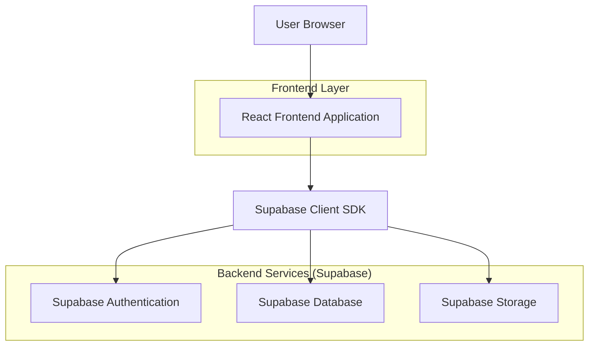
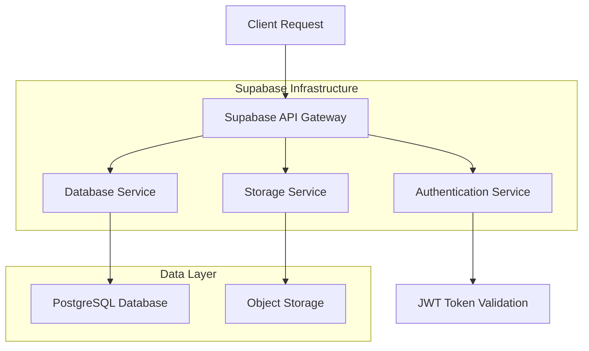
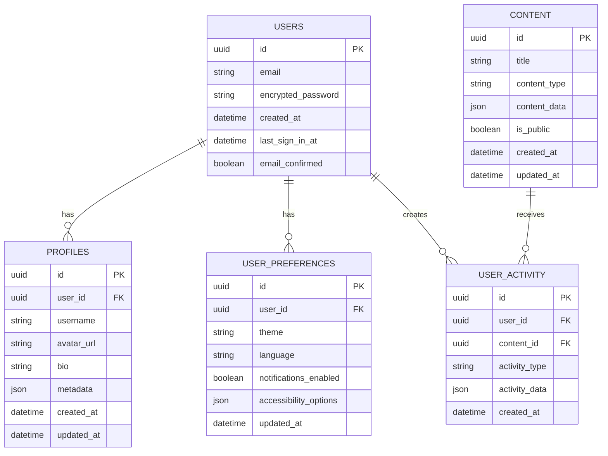

## 1. Architecture Design



## 2. Technology Description

- **Frontend**: React@18 + tailwindcss@3 + vite
- **Initialization Tool**: vite-init
- **Backend**: Supabase (Authentication, Database, Storage)
- **Testing**: Jest + React Testing Library + Cypress
- **State Management**: React Context + useReducer
- **Routing**: React Router v6
- **UI Components**: HeadlessUI + Heroicons

## 3. Route Definitions

| Route | Purpose |
|-------|---------|
| / | Home page with hero section and navigation |
| /login | User authentication page with form validation |
| /register | User registration with email confirmation |
| /dashboard | User dashboard with personalized content |
| /profile | User profile management and settings |
| /settings | Application preferences and accessibility options |
| /content | Content browsing with search and filters |
| /admin | Admin panel for user and content management |
| /error | Error page with recovery options |
| /offline | Offline mode notification and cached content |

## 4. API Definitions

### 4.1 Authentication APIs

**User Registration**
```
POST /auth/v1/signup
```

Request:
| Param Name | Param Type | isRequired | Description |
|------------|------------|-------------|-------------|
| email | string | true | User email address |
| password | string | true | User password (min 6 characters) |

Response:
| Param Name | Param Type | Description |
|------------|-------------|-------------|
| user | object | User object with id, email |
| session | object | Authentication session token |

**User Login**
```
POST /auth/v1/token
```

Request:
| Param Name | Param Type | isRequired | Description |
|------------|------------|-------------|-------------|
| email | string | true | User email address |
| password | string | true | User password |

### 4.2 Database APIs

**Get User Profile**
```
GET /rest/v1/profiles?id=eq.{userId}
```

**Update User Profile**
```
PATCH /rest/v1/profiles?id=eq.{userId}
```

Request:
| Param Name | Param Type | isRequired | Description |
|------------|------------|-------------|-------------|
| name | string | false | User display name |
| avatar_url | string | false | Profile picture URL |
| preferences | object | false | User preferences JSON |

**Get Content List**
```
GET /rest/v1/content?select=*&order=created_at.desc&limit=20
```

Query Parameters:
| Param Name | Param Type | Description |
|------------|-------------|-------------|
| search | string | Search term for content |
| category | string | Filter by category |
| page | number | Pagination offset |

## 5. Server Architecture Diagram



## 6. Data Model

### 6.1 Database Schema



### 6.2 Data Definition Language

**Users Table**
```sql
-- Create users table (managed by Supabase Auth)
CREATE TABLE IF NOT EXISTS auth.users (
    id UUID PRIMARY KEY DEFAULT gen_random_uuid(),
    email VARCHAR(255) UNIQUE NOT NULL,
    encrypted_password VARCHAR(255) NOT NULL,
    created_at TIMESTAMP WITH TIME ZONE DEFAULT NOW(),
    last_sign_in_at TIMESTAMP WITH TIME ZONE,
    email_confirmed_at TIMESTAMP WITH TIME ZONE
);

-- Grant permissions
GRANT SELECT ON auth.users TO anon;
GRANT ALL ON auth.users TO authenticated;
```

**Profiles Table**
```sql
-- Create profiles table
CREATE TABLE public.profiles (
    id UUID PRIMARY KEY DEFAULT gen_random_uuid(),
    user_id UUID REFERENCES auth.users(id) ON DELETE CASCADE,
    username VARCHAR(50) UNIQUE,
    avatar_url TEXT,
    bio TEXT,
    metadata JSONB DEFAULT '{}',
    created_at TIMESTAMP WITH TIME ZONE DEFAULT NOW(),
    updated_at TIMESTAMP WITH TIME ZONE DEFAULT NOW()
);

-- Create indexes
CREATE INDEX idx_profiles_user_id ON public.profiles(user_id);
CREATE INDEX idx_profiles_username ON public.profiles(username);

-- Grant permissions
GRANT SELECT ON public.profiles TO anon;
GRANT ALL ON public.profiles TO authenticated;
```

**User Preferences Table**
```sql
-- Create user preferences table
CREATE TABLE public.user_preferences (
    id UUID PRIMARY KEY DEFAULT gen_random_uuid(),
    user_id UUID REFERENCES auth.users(id) ON DELETE CASCADE,
    theme VARCHAR(20) DEFAULT 'light' CHECK (theme IN ('light', 'dark', 'auto')),
    language VARCHAR(10) DEFAULT 'en',
    notifications_enabled BOOLEAN DEFAULT true,
    accessibility_options JSONB DEFAULT '{"fontSize": "medium", "highContrast": false, "reducedMotion": false}',
    updated_at TIMESTAMP WITH TIME ZONE DEFAULT NOW()
);

-- Create indexes
CREATE INDEX idx_user_preferences_user_id ON public.user_preferences(user_id);

-- Grant permissions
GRANT SELECT ON public.user_preferences TO anon;
GRANT ALL ON public.user_preferences TO authenticated;
```

**Content Table**
```sql
-- Create content table
CREATE TABLE public.content (
    id UUID PRIMARY KEY DEFAULT gen_random_uuid(),
    title VARCHAR(255) NOT NULL,
    content_type VARCHAR(50) NOT NULL,
    content_data JSONB NOT NULL,
    is_public BOOLEAN DEFAULT true,
    created_at TIMESTAMP WITH TIME ZONE DEFAULT NOW(),
    updated_at TIMESTAMP WITH TIME ZONE DEFAULT NOW()
);

-- Create indexes
CREATE INDEX idx_content_type ON public.content(content_type);
CREATE INDEX idx_content_public ON public.content(is_public);
CREATE INDEX idx_content_created_at ON public.content(created_at DESC);

-- Grant permissions
GRANT SELECT ON public.content TO anon;
GRANT ALL ON public.content TO authenticated;
```

**User Activity Table**
```sql
-- Create user activity table
CREATE TABLE public.user_activity (
    id UUID PRIMARY KEY DEFAULT gen_random_uuid(),
    user_id UUID REFERENCES auth.users(id) ON DELETE CASCADE,
    content_id UUID REFERENCES public.content(id) ON DELETE CASCADE,
    activity_type VARCHAR(50) NOT NULL,
    activity_data JSONB DEFAULT '{}',
    created_at TIMESTAMP WITH TIME ZONE DEFAULT NOW()
);

-- Create indexes
CREATE INDEX idx_user_activity_user_id ON public.user_activity(user_id);
CREATE INDEX idx_user_activity_content_id ON public.user_activity(content_id);
CREATE INDEX idx_user_activity_type ON public.user_activity(activity_type);
CREATE INDEX idx_user_activity_created_at ON public.user_activity(created_at DESC);

-- Grant permissions
GRANT SELECT ON public.user_activity TO anon;
GRANT ALL ON public.user_activity TO authenticated;
```

### 6.3 Row Level Security Policies

**Profiles Policies**
```sql
-- Users can view all profiles
CREATE POLICY "Public profiles are viewable by everyone" 
ON public.profiles FOR SELECT 
USING (true);

-- Users can insert their own profile
CREATE POLICY "Users can insert their own profile" 
ON public.profiles FOR INSERT 
WITH CHECK (auth.uid() = user_id);

-- Users can update their own profile
CREATE POLICY "Users can update their own profile" 
ON public.profiles FOR UPDATE 
USING (auth.uid() = user_id);
```

**User Preferences Policies**
```sql
-- Users can view their own preferences
CREATE POLICY "Users can view own preferences" 
ON public.user_preferences FOR SELECT 
USING (auth.uid() = user_id);

-- Users can update their own preferences
CREATE POLICY "Users can update own preferences" 
ON public.user_preferences FOR UPDATE 
USING (auth.uid() = user_id);
```

## 7. Error Handling Architecture

### 7.1 Frontend Error Boundaries
```javascript
// Error boundary component structure
class ErrorBoundary extends React.Component {
  componentDidCatch(error, errorInfo) {
    // Log error to monitoring service
    logError(error, errorInfo);
  }
  
  render() {
    if (this.state.hasError) {
      return <ErrorFallbackUI />;
    }
    return this.props.children;
  }
}
```

### 7.2 API Error Handling
```javascript
// Standardized error response format
{
  "error": {
    "code": "AUTH_INVALID_CREDENTIALS",
    "message": "Invalid email or password",
    "details": {
      "field": "password",
      "suggestion": "Check your password and try again"
    }
  }
}
```

### 7.3 Network Error Recovery
- Automatic retry with exponential backoff
- Offline queue for failed requests
- Graceful degradation with cached data
- User notification system for critical errors